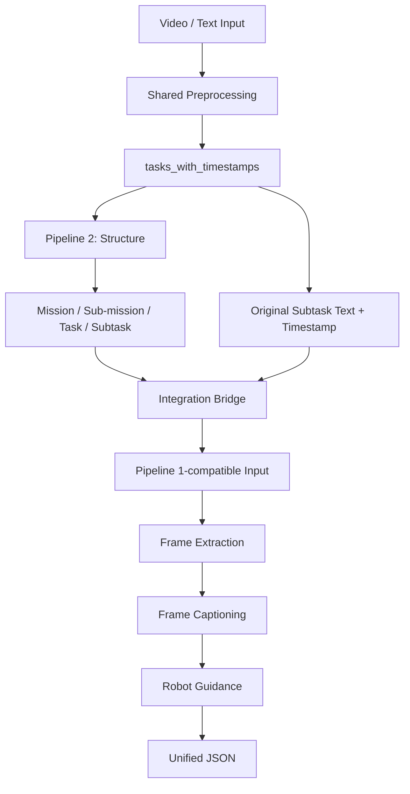
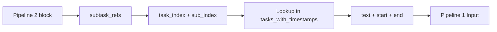
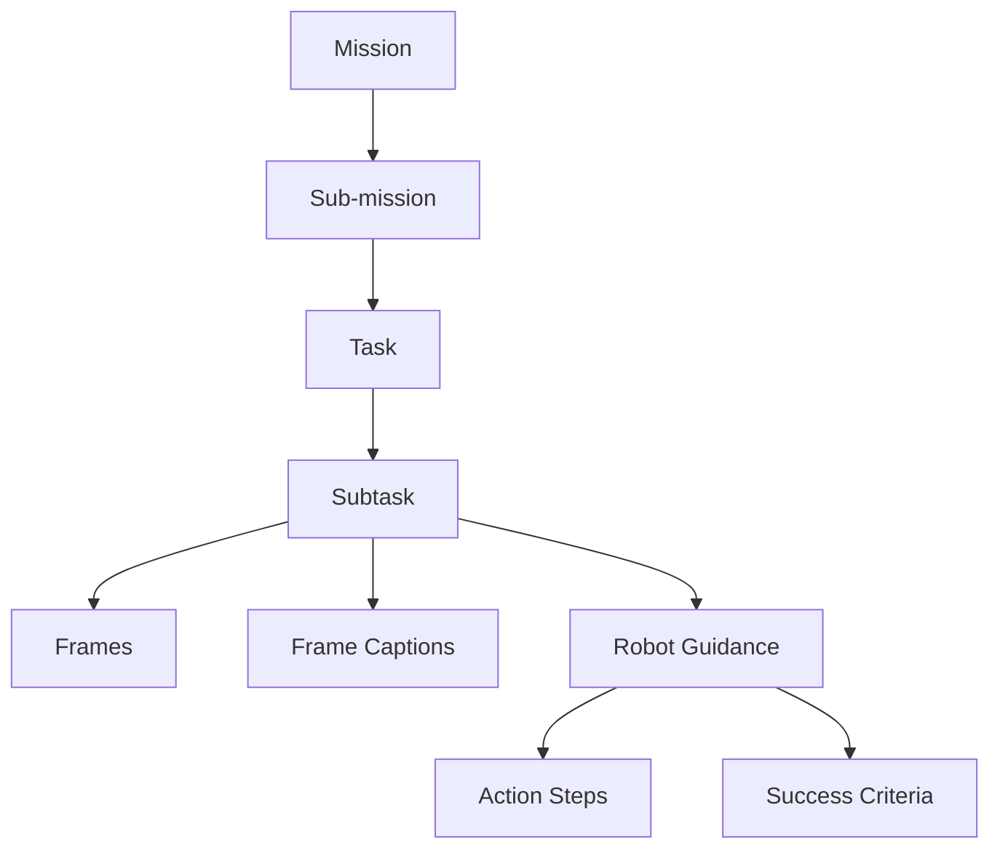
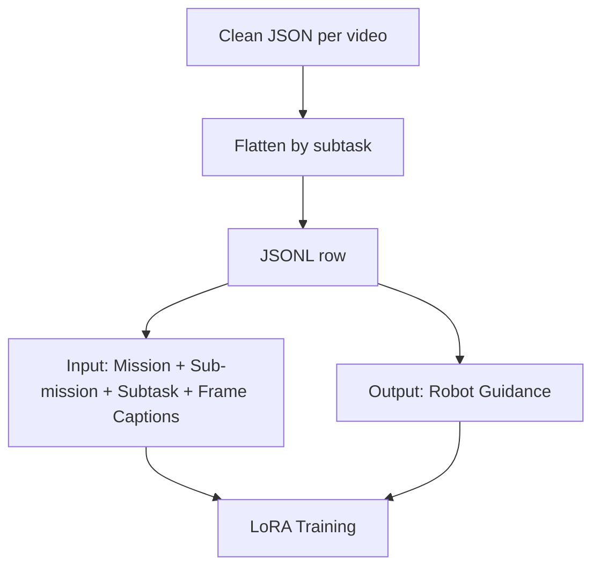

# Integration Diagrams

## Overall Integration

```mermaid
flowchart TD
    A[Video / Text Input] --> B[Shared Preprocessing]
    B --> C[tasks_with_timestamps]

    C --> D[Pipeline 2: Structure]
    D --> E[Mission / Sub-mission / Task / Subtask]

    C --> F[Original Subtask Text + Timestamp]

    E --> G[Integration Bridge]
    F --> G

    G --> H[Pipeline 1-compatible Input]
    H --> I[Frame Extraction]
    I --> J[Frame Captioning]
    J --> K[Robot Guidance]
    K --> L[Unified JSON]
```

## Data Mapping

```mermaid
flowchart LR
    A[Pipeline 2 block] --> B[subtask_refs]
    B --> C[task_index + sub_index]
    C --> D[Lookup in tasks_with_timestamps]
    D --> E[text + start + end]
    E --> F[Pipeline 1 Input]
```

## Final Unified Dataset

```mermaid
flowchart TD
    A[Mission] --> B[Sub-mission]
    B --> C[Task]
    C --> D[Subtask]
    D --> E[Frames]
    D --> F[Frame Captions]
    D --> G[Robot Guidance]
    G --> H[Action Steps]
    G --> I[Success Criteria]
```

## Training Conversion

```mermaid
flowchart TD
    A[Clean JSON per video] --> B[Flatten by subtask]
    B --> C[JSONL row]
    C --> D[Input: Mission + Sub-mission + Subtask + Frame Captions]
    C --> E[Output: Robot Guidance]
    D --> F[LoRA Training]
    E --> F
```
