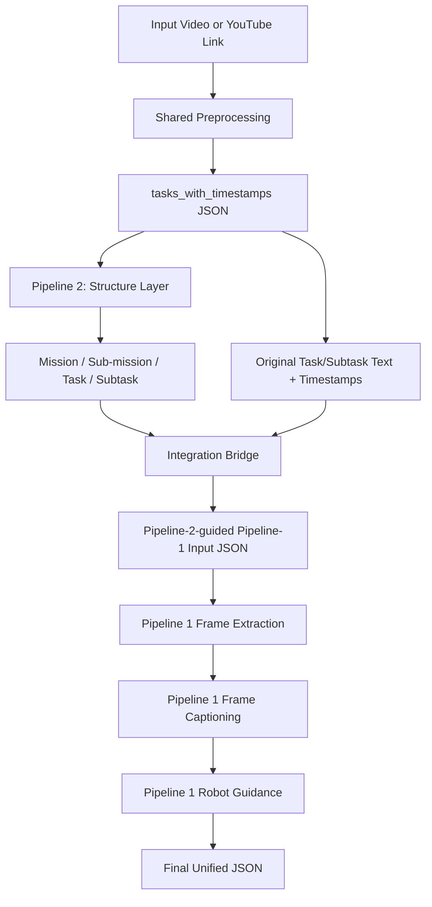
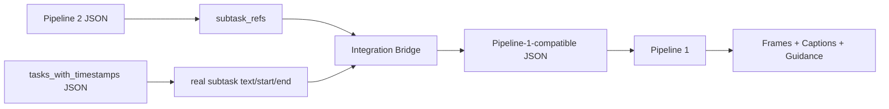
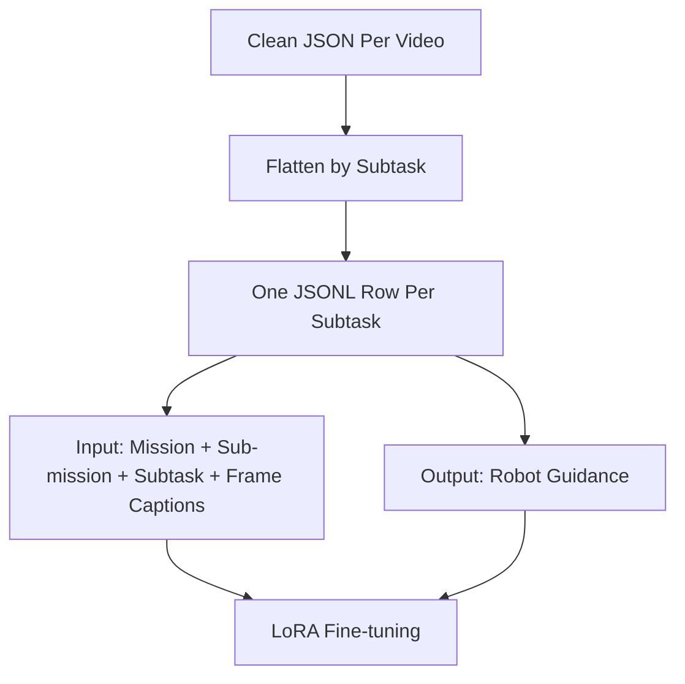

# Code Update: Pipeline 1 + Pipeline 2 Integration Handoff

This folder explains how to connect Pipeline 2 and Pipeline 1 into one unified pipeline.

The goal is to help a new developer start quickly.

---

## 1. Current Status

Currently, Pipeline 1 and Pipeline 2 are mostly separate.

```text
results/tasks_with_timestamps/<video_id>.json
        ├── Pipeline 1 → robot guidance
        └── Pipeline 2 → mission / sub-mission / task structure
```

We have started the integration.

The first working bridge now does:

```text
Pipeline 2 output
+ original tasks_with_timestamps
↓
Pipeline-2-guided Pipeline-1 input
↓
Pipeline 1 frame extraction / captioning / guidance
```

The first integrated JSON contains:

```text
mission
sub-mission metadata
subtask text
timestamps
frames
captions
guidance_text
```

So the connection is working at the data level.

The remaining work is making it clean, reliable, validated, and training-ready.

---

## 2. Big Picture Goal

Final integrated system:

```text
Video / Text Input
        ↓
Shared preprocessing
        ↓
tasks_with_timestamps
        ↓
Pipeline 2: structure layer
        ↓
Mission → Sub-mission → Task → Subtask
        ↓
Pipeline 1: execution layer
        ↓
Frames → Captions → Robot Guidance
        ↓
Final unified dataset
```

Final output should be:

```text
Mission
└── Sub-mission
    └── Task
        └── Subtask
            ├── timestamp
            ├── category
            ├── frames
            ├── frame captions
            ├── robot guidance
            ├── ordered robot action steps
            └── success criteria
```

---

## 3. Main Integration Diagram



---

## 4. Why Integration Is Not Just One Simple Connection

The basic connection is simple.

The hard part is making it reliable and training-ready.

Main issues:

```text
1. Pipeline 2 and Pipeline 1 have different JSON formats.
2. Pipeline 2 stores subtask references using task_index and sub_index.
3. Pipeline 1 needs explicit subtask text, start time, and end time.
4. Mission/sub-mission context must not be lost.
5. Some frame captions are noisy.
6. Some generated robot guidance is hallucinated or weak.
7. Some subtasks may have missing frames.
8. Final output must be validated before training.
```

So the work is not only:

```text
connect file A to file B
```

It is:

```text
connect → preserve hierarchy → generate guidance → validate → clean → prepare training data
```

---

## 5. Repository Folder Explanation

### 5.1 `scripts/preprocessing/`

Purpose:

```text
Extract transcript, tasks, subtasks, and timestamps from videos.
```

Important output:

```text
results/tasks_with_timestamps/<video_id>.json
```

This is the shared base data used by both pipelines.

---

### 5.2 `scripts/pipeline2_structure_task_dataset/`

Purpose:

```text
Build mission-level and sub-mission-level task structure.
```

Pipeline 2 produces high-level reasoning structure.

Important stages:

```text
build_subtask_threads.py
thread_logic_check.py
categorize_tasks_and_subtasks.py
regroup_subtasks_coherence.py
add_submissions_to_coherent_blocks.py
generate_task_blueprints.py
generate_check_reports.py
generate_training_quality_log_submissions.py
```

Important output:

```text
results/pipeline2_structured_task_dataset/coherent_blocks_with_submissions/<video_id>.json
```

Pipeline 2 output includes:

```text
mission_id
mission_title
sub_missions
blocks
subtask_refs
dominant_category
category_distribution
```

Important field:

```json
"subtask_refs": [
  {
    "task_index": 0,
    "sub_index": 0
  }
]
```

These references point back to the original `tasks_with_timestamps` JSON.

---

### 5.3 `scripts/pipeline1_robot_guidance_model/`

Purpose:

```text
Generate robot guidance for each subtask using video frames and frame captions.
```

Important scripts:

```text
extract_frames_from_subtasks.py
frame_captions.py
subtask_guidance.py
subtask_guidance_improved.py
batch_export_all_videos.py
```

Pipeline 1 expects data in this format:

```text
tasks
└── subtasks
    ├── text
    ├── start
    └── end
```

Pipeline 1 produces:

```text
frames
frame captions
guidance_text
```

Guidance sections:

```text
GLOBAL_SUMMARY
FRAME_BASED_OBSERVATIONS
INTEGRATED_SCENE_UNDERSTANDING
PRECONDITIONS_FOR_ROBOT
SUCCESS_CRITERIA
ORDERED_ROBOT_ACTION_STEPS
SUBTASK_STORY
```

---

### 5.4 `scripts/integration/`

Purpose:

```text
New folder for connecting Pipeline 2 to Pipeline 1.
```

This folder should contain the new integration scripts.

Current/new scripts:

```text
build_pipeline2_guided_pipeline1_input.py
frame_captions_unified.py
subtask_guidance_unified.py
validate_unified_pipeline_json.py
```

#### `build_pipeline2_guided_pipeline1_input.py`

Purpose:

```text
Convert Pipeline 2 output into Pipeline 1-compatible input.
```

Inputs:

```text
Pipeline 2 JSON:
results/pipeline2_structured_task_dataset/coherent_blocks_with_submissions/<video_id>.json

Original timestamp JSON:
results/tasks_with_timestamps/<video_id>.json
```

Output:

```text
results/unified_pipeline/pipeline2_guided_tasks/<video_id>.json
```

What it does:

```text
1. Load Pipeline 2 blocks.
2. Read subtask_refs.
3. Use task_index and sub_index to find original subtask text/start/end.
4. Preserve mission and sub-mission metadata.
5. Save a new JSON that Pipeline 1 can read.
```

#### `frame_captions_unified.py`

Purpose:

```text
Run frame captioning while preserving Pipeline 2 mission/sub-mission metadata.
```

Input:

```text
results/unified_pipeline/pipeline2_guided_tasks/<video_id>.json
```

Output:

```text
results/unified_pipeline/frame_captions/<video_id>.json
```

#### `subtask_guidance_unified.py`

Purpose:

```text
Generate robot guidance using both subtask information and Pipeline 2 mission context.
```

It should include this context in the prompt:

```text
mission_title
sub_mission_title
high_level_task
pipeline2_category
subtask_text
frame captions
```

Output:

```text
results/unified_pipeline/subtask_guidance/<video_id>.json
```

#### `validate_unified_pipeline_json.py`

Purpose:

```text
Check if integrated JSON is clean enough for training.
```

Checks:

```text
mission exists
sub-mission exists
timestamps exist
frames exist
captions are not empty
guidance_text exists
required guidance sections exist
action steps exist
verification step exists
human-delegation language is flagged
```

Output:

```text
results/unified_pipeline/validation_reports/<video_id>_validation.json
```

---

### 5.5 `results/tasks_with_timestamps/`

Purpose:

```text
Shared base data for both pipelines.
```

This is the most important common input.

Used by:

```text
Pipeline 1
Pipeline 2
integration bridge
```

---

### 5.6 `results/pipeline2_structured_task_dataset/`

Purpose:

```text
Stores Pipeline 2 outputs.
```

Important subfolders:

```text
subtask_threads/
thread_logic/
categorized_threads/
coherent_blocks/
coherent_blocks_with_submissions/
task_blueprints/
check_reports/
training_quality_log_submissions/
plots/
```

Most important file for integration:

```text
coherent_blocks_with_submissions/<video_id>.json
```

---

### 5.7 `results/unified_pipeline/`

Purpose:

```text
New output folder for the integrated system.
```

Recommended structure:

```text
results/unified_pipeline/
├── pipeline2_guided_tasks/
├── frame_extractions/
├── frame_captions/
├── subtask_guidance/
├── validation_reports/
├── clean_json_per_video/
└── training_jsonl/
```

Meaning:

```text
pipeline2_guided_tasks/    = Pipeline 2 converted into Pipeline 1 input
frame_extractions/         = frames extracted from unified subtasks
frame_captions/            = frame captions with mission context preserved
subtask_guidance/          = robot guidance with mission/sub-mission context
validation_reports/        = quality reports
clean_json_per_video/      = final cleaned JSON files
training_jsonl/            = combined training files
```

---

## 6. Data Connection Diagram



Pipeline 2 has:

```json
"subtask_refs": [
  {
    "task_index": 0,
    "sub_index": 0
  }
]
```

Original timestamp file has:

```json
"tasks": [
  {
    "subtasks": [
      {
        "text": "Consult with extension officers...",
        "start": 4.05,
        "end": 13.05
      }
    ]
  }
]
```

The integration script maps:

```text
task_index=0, sub_index=0
↓
actual subtask text/start/end
```

---

## 7. Exact Process To Continue

### Step 1: Run Pipeline 2

Make sure this file exists:

```text
results/pipeline2_structured_task_dataset/coherent_blocks_with_submissions/<video_id>.json
```

Example:

```text
results/pipeline2_structured_task_dataset/coherent_blocks_with_submissions/_1k9XR8ZFTk.json
```

### Step 2: Confirm original timestamp file exists

```text
results/tasks_with_timestamps/<video_id>.json
```

If not, search:

```bash
find results -name "*_1k9XR8ZFTk*.json"
```

### Step 3: Build Pipeline-2-guided Pipeline-1 input

```bash
python scripts/integration/build_pipeline2_guided_pipeline1_input.py   --pipeline2_json results/pipeline2_structured_task_dataset/coherent_blocks_with_submissions/_1k9XR8ZFTk.json   --tasks_json results/tasks_with_timestamps/_1k9XR8ZFTk.json   --output_dir results/unified_pipeline/pipeline2_guided_tasks
```

Expected output:

```text
results/unified_pipeline/pipeline2_guided_tasks/_1k9XR8ZFTk.json
```

### Step 4: Run frame extraction

Update `extract_frames_from_subtasks.py`.

Change:

```python
JSON_DIR = Path("results/tasks_with_timestamps")
```

to:

```python
JSON_DIR = Path("results/unified_pipeline/pipeline2_guided_tasks")
```

Then run:

```bash
python scripts/pipeline1_robot_guidance_model/extract_frames_from_subtasks.py
```

Expected output:

```text
results/frame_extractions/_1k9XR8ZFTk/
```

### Step 5: Run unified frame captioning

```bash
python scripts/integration/frame_captions_unified.py
```

Expected output:

```text
results/unified_pipeline/frame_captions/_1k9XR8ZFTk.json
```

### Step 6: Run unified robot guidance

```bash
python scripts/integration/subtask_guidance_unified.py _1k9XR8ZFTk.json
```

Expected output:

```text
results/unified_pipeline/subtask_guidance/_1k9XR8ZFTk.json
```

### Step 7: Validate integrated JSON

```bash
python scripts/integration/validate_unified_pipeline_json.py   --input_json results/unified_pipeline/subtask_guidance/_1k9XR8ZFTk.json   --output_dir results/unified_pipeline/validation_reports
```

Expected output:

```text
results/unified_pipeline/validation_reports/_1k9XR8ZFTk_validation.json
```

Possible status:

```text
pass = clean enough
warn = integration works but needs cleaning
fail = missing important fields
```

At the current stage, `warn` is expected.

---

## 8. What Has Already Worked

For video:

```text
_1k9XR8ZFTk
```

We successfully produced a unified JSON containing:

```text
mission title
sub-mission metadata
Pipeline 2 block/category metadata
subtask text
timestamps
frames
captions
guidance_text
```

This confirms:

```text
Pipeline 2 → Pipeline 1 connection works at data level
```

---

## 9. What Still Needs Work

### 9.1 Quality Cleaning

Some captions are noisy.

Examples:

```text
"a woman is slicing a piece of bread with a scythe"
"black and white image of a black and white image..."
"white shirt and a white shirt..."
```

These should be flagged and filtered.

### 9.2 Guidance Cleaning

Some robot guidance is hallucinated or not executable.

Examples:

```text
Ask the extension officer...
Request the AgroDealer...
Navigate to the AgroDealer...
```

These may be rewritten as:

```text
Read/verify the instructional recommendation.
Record the recommended variety or seed source.
Report the recommendation.
```

### 9.3 Missing Frames

Some subtasks may have:

```json
"frames": []
```

Need policy:

```text
Option A: skip for visual training
Option B: keep as text-only guidance sample
Option C: re-run frame extraction
```

Recommended:

```text
For training:
- keep if text-only mode is allowed
- otherwise skip missing-frame subtasks
```

### 9.4 Final Training Data Conversion

Clean JSON per video should be converted into one combined JSONL.

Recommended training format:

```json
{
  "instruction": "Generate robot guidance using mission, sub-mission, task, subtask, and frame captions.",
  "input": {
    "mission": "...",
    "sub_mission": "...",
    "task": "...",
    "subtask": "...",
    "timestamps": [4.05, 13.05],
    "frame_captions": ["..."]
  },
  "output": {
    "guidance_text": ["GLOBAL_SUMMARY:", "..."]
  }
}
```

One JSONL row should be:

```text
one subtask sample
```

Not:

```text
one frame sample
```

Frames should be grouped under their subtask.

---

## 10. Training Data Diagram



---

## 11. Recommended Work Plan For New Developer

### Day 1

```text
Read this README.
Run the bridge script on _1k9XR8ZFTk.
Confirm unified JSON is produced.
```

### Day 2

```text
Run frame extraction, captioning, and guidance.
Confirm mission/sub-mission context survives.
```

### Day 3

```text
Run validation.
Inspect warnings.
Write rules for bad captions and bad guidance.
```

### Day 4–5

```text
Run on 5–10 videos.
Fix format mismatches.
Confirm stable output folders.
```

### Week 2

```text
Create clean_json_per_video.
Create training_jsonl.
Run small LoRA training test.
```

---

## 12. Simple Explanation For Professor

```text
Pipeline 2 gives the robot the big-picture structure:
mission, sub-mission, task, and subtask.

Pipeline 1 gives the robot execution-level understanding:
frames, captions, robot steps, success criteria, and verification.

The integration keeps both:
Pipeline 2 structure + Pipeline 1 execution guidance.
```

---

## 13. Current Main Message

The integration is working at the data level.

Now the main remaining task is:

```text
make the integrated output clean enough for training
```

That requires:

```text
validation
caption filtering
guidance cleaning
missing-frame handling
training JSONL conversion
testing across multiple videos
```

---

## 14. Handoff Summary

New developer should start from:

```text
scripts/integration/build_pipeline2_guided_pipeline1_input.py
```

Then run:

```text
frame extraction
frame_captions_unified.py
subtask_guidance_unified.py
validate_unified_pipeline_json.py
```

Final target:

```text
results/unified_pipeline/clean_json_per_video/
results/unified_pipeline/training_jsonl/
```


## Runing Videos - you can change number you needed.
