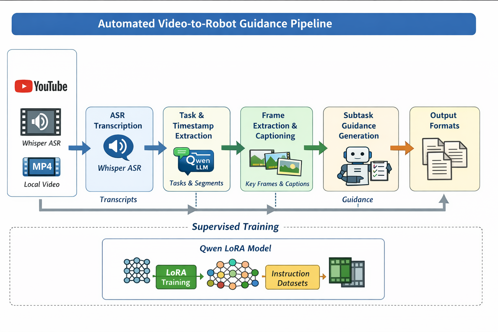
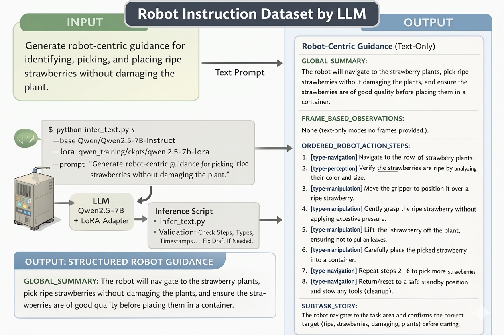
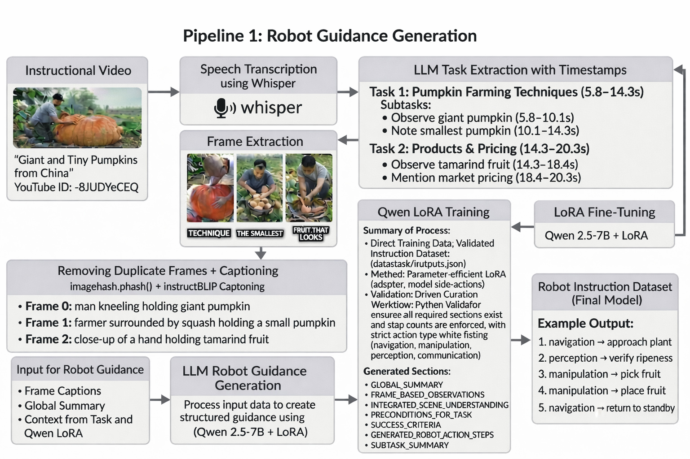

# Pipeline 1 --- Robot Guidance Generation

## Overview

Pipeline 1 converts **timestamped tasks and subtasks** into
**robot‑centric procedural guidance** grounded in visual observations
from video frames.

It starts from the shared output:

results/tasks_with_timestamps/`<video_id>`{=html}.json

and produces:

-   visually grounded subtask representations
-   structured robot guidance instructions
-   exportable guidance documents
-   high‑quality supervision data for **Qwen LoRA instruction tuning**

Pipeline 1 integrates:

-   frame extraction from timestamped subtasks
-   visual grounding through frame captioning
-   structured robot guidance generation
-   export and dataset preparation for training

------------------------------------------------------------------------

# Pipeline 1 Workflow

tasks_with_timestamps\
↓\
frame extraction\
↓\
frame deduplication\
↓\
frame captioning\
↓\
robot guidance generation\
↓\
guidance export\
↓\
LoRA training dataset preparation

------------------------------------------------------------------------

# Input

Pipeline 1 expects input from the shared preprocessing stage:

results/tasks_with_timestamps/`<video_id>`{=html}.json

Each file contains:

-   video metadata
-   tasks
-   subtasks
-   timestamp intervals
-   Whisper segment IDs

These timestamps define where visual grounding should occur.

------------------------------------------------------------------------

# Step 1 --- Frame Extraction

Script:

scripts/pipeline1_robot_guidance/extract_frames_from_subtasks.py

This step extracts representative frames for every subtask based on
timestamp intervals.

### Frame Sampling Strategy

For each subtask:

-   minimum **3 frames**
-   approximately **1 frame every 5 seconds**
-   maximum **20 frames**
-   uniform spacing between start and end timestamps

Subtasks without valid timestamps are skipped.

### Run

python scripts/pipeline1_robot_guidance/extract_frames_from_subtasks.py
--input_dir results/tasks_with_timestamps --video_dir
`<video_folder>`{=html} --output_dir
results/pipeline1_robot_guidance/frame_extractions

### Output

results/pipeline1_robot_guidance/frame_extractions/`<video_id>`{=html}/\
taskXX_subYY_fZZ.jpg

------------------------------------------------------------------------

# Step 2 --- Frame Deduplication and Captioning

Script:

scripts/pipeline1_robot_guidance/frame_captions.py

This stage performs **visual grounding**.

### Processing Steps

1.  Remove near‑duplicate frames using **perceptual hashing (pHash)**
2.  Generate captions for remaining frames using a vision‑language model

Supported models include:

-   **InstructBLIP**
-   **Qwen‑VL**

### Run

python scripts/pipeline1_robot_guidance/frame_captions.py --frames_dir
results/pipeline1_robot_guidance/frame_extractions --tasks_dir
results/tasks_with_timestamps --output_dir
results/pipeline1_robot_guidance/frame_captions

### Output

results/pipeline1_robot_guidance/frame_captions/`<video_id>`{=html}.json

Each subtask gains a `frames` field containing:

-   frame_index\
-   frame_path\
-   caption

------------------------------------------------------------------------

# Step 3 --- Robot Guidance Generation

Script:

scripts/pipeline1_robot_guidance/subtask_guidance.py

This step uses **Qwen‑2.5‑7B** to convert subtasks and frame captions
into structured robot guidance.

Inputs:

-   subtask text
-   timestamp range
-   frame captions

### Generated Sections

GLOBAL_SUMMARY\
FRAME_BASED_OBSERVATIONS\
INTEGRATED_SCENE_UNDERSTANDING\
PRECONDITIONS_FOR_ROBOT\
SUCCESS_CRITERIA\
ORDERED_ROBOT_ACTION_STEPS\
SUBTASK_STORY

These sections are attached to each subtask as `guidance_text`.

### Run

python scripts/pipeline1_robot_guidance/subtask_guidance.py --input_dir
results/pipeline1_robot_guidance/frame_captions --model
Qwen/Qwen2.5-7B-Instruct --output_dir
results/pipeline1_robot_guidance/subtask_guidance

### Output

results/pipeline1_robot_guidance/subtask_guidance/`<video_id>`{=html}.json

------------------------------------------------------------------------

# Step 4 --- Export Final Guidance

Script:

scripts/pipeline1_robot_guidance/batch_export_all_videos.py

This converts nested JSON structures into readable documents.

Supported formats:

-   TXT
-   HTML
-   DOCX

### Run

python scripts/pipeline1_robot_guidance/batch_export_all_videos.py
--input_dir results/pipeline1_robot_guidance/subtask_guidance
--output_dir results/pipeline1_robot_guidance/final_guidance_txt

### Output

results/pipeline1_robot_guidance/final_guidance_txt/`<video_id>`{=html}.txt

------------------------------------------------------------------------

# Step 5 --- Qwen LoRA Training

The generated robot guidance is used to create **instruction‑tuning
datasets**.

Location:

models/pipeline1_robot_guidance/qwen_training_updated/

Training configuration:

Base model: Qwen/Qwen2.5-7B-Instruct\
Method: LoRA\
Trainable parameters: \~0.26%

Artifacts:

ckpts/\
adapter_model.safetensors\
adapter_config.json\
trainer_state.json

------------------------------------------------------------------------

# Improved Training Pipeline

The updated training workflow introduces a **Generate → Validate →
Repair** data curation process.

### Validation Rules

Training samples must satisfy:

-   all required sections exist
-   no truncated outputs
-   allowed step types only

navigation\
manipulation\
perception\
communication

Additional checks:

-   robot‑only actions
-   no hallucinated tools
-   verification steps included

### Repair Loop

LLM draft\
↓\
Python validator\
↓\
LLM rewrite\
↓\
Python recheck

Only validated samples are retained.

------------------------------------------------------------------------

# Text‑Only Inference Mode

The trained LoRA model supports **text‑only robot guidance generation**.

Example:

python infer_text.py --base Qwen/Qwen2.5-7B-Instruct --lora
ckpts/qwen2.5-7b-lora --prompt "Generate robot guidance for testing soil
pH"

Guarantees:

-   structured sections
-   valid action types
-   verification steps
-   no visual dependency

------------------------------------------------------------------------

# Output Structure

results/

pipeline1_robot_guidance/

frame_extractions/\
frame_captions/\
subtask_guidance/\
final_guidance_txt/

------------------------------------------------------------------------
## Example Outputs

### Structured Robot Guidance Output

This figure shows an example of text-only robot guidance generated by the Qwen-2.5-7B + LoRA model. The output includes structured sections such as GLOBAL_SUMMARY and ORDERED_ROBOT_ACTION_STEPS, ensuring the instructions are interpretable and executable.

---

### End-to-End Pipeline Output

This figure illustrates the full transformation from instructional video input to structured robot guidance output, including task extraction, frame grounding, and final action sequences.
# Purpose

Pipeline 1 produces **robot‑centric procedural knowledge** from videos.

The outputs support:

-   instruction‑tuning datasets
-   robot policy learning
-   agent planning systems
-   multimodal reasoning research

By grounding instructions in **timestamps and visual observations**, the
pipeline creates **high‑quality supervision for robotic task learning**.
