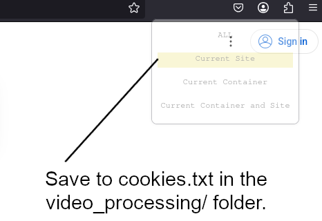

# Video Processing

This folder is for the downloading and transcribing of videos into .txt transcripts.

## Quick Start

You should be using the Whisper environment described in the root README.

Run the command:

	sbatch batchvideos.slurm

This will download all the videos using both **videos.txt (handcrafted dataset) and videos_s1.txt (automatatically generated)**, and then transcribe them into the transcripts/ folder. You can edit the .slurm file to change parameters, as currently it will download only 100 videos, 15 at a time, seperated by 5 minute intervals.

**videos.txt (handcrafted dataset) and videos_s1.txt (automatatically generated)** files are under this folder:
https://github.com/greatroboticslab/HumanoidRobotTrainingData/tree/main/video_processing/output/video_downloading

### Cookies

You may also need cookies.txt in this directory. Create the file, and use a cookies extraction extension to paste them into this file. This is due to YouTube blocking mass downloads of videos. [Here is a link describing how to get the cookies file from the yt-dlp repo.](https://github.com/yt-dlp/yt-dlp/wiki/Extractors#exporting-youtube-cookies)

Essenetially, we need to do this. YouTube rotates account cookies frequently on open YouTube browser tabs as a security measure. To export cookies that will remain working with yt-dlp, you will need to export cookies in such a way that they are never rotated.

One way to do this is through a private browsing/incognito window:

Open a new private browsing/incognito window and log into YouTube

Open a new tab and close the YouTube tab

You need an extension for a browser, such as for firefox cookie management extenion (Get cookies.txt LOCALLY)

Export youtube.com cookies from the browser then close the private browsing/incognito window so the session is never opened in the browser again.

The cookies file needs to be under the video_processing folder. 

## Videos

YouTube videos are defined in videos.txt. You should paste the URLs of all the YouTube videos you wish to download, seperated by a newline.

### Search Terms

You can put a list of searches into search_terms.txt, and run youtube_search.py to get the URLS of Creative Commons videos that show up when that search is used. The usage of youtube_search.py is as follows:

	youtube_search.py --input_file <name of input file, usually search_terms.txt>  --api_key <a Google API key that can use the YouTube V3 API> --max_results <how many videos the script will try to pull per search>

After search, it will generate video_s1.txt file. In this file, it includes video URLS, name, and indexes of the videos. Then, you need to run the following to download the videos.

	sbatch batchvideos.slurm

 
Example:

	python youtube_search.py --input_file search_terms.txt --api_key 1234567890REMOVEDOURAPIASIKEYTSPRIVATEINFO0987654321 --max_results 3

There is a script in the s1_baseline/ folder that generates a list of search terms, and outputs it to search_terms.txt.

         After the command run, it will generate video_s1.text. 

### Identification

identify_videos.py can be called to generate a .csv list of videos, ids, and urls. This is useful for finding out what video belongs to what url and vice-versa.

	python identify_videos.py

 The command will generate the file

 https://github.com/greatroboticslab/HumanoidRobotTrainingData/blob/main/video_processing/output/video_data.csv
 
The last column of the file is editable by human so that we can change the relavance of the video. The reason we do this is becuase S1 is not able to precisely identify the relavance of the video. S1 will then be used to update this file accordingly.

### Transcription

After all videos are downloaded and identified, you will need to generate transcripts.

	conda activate whisper
	python masswhisper.py

This will generate text transcripts of the videos. If a transcript already exists, then it will be skipped to save computer resources and time.

### Local Download

In order to download videos from PSC, you need to run this:

You can use this command:

	scp username@bridges2.psc.edu:"<DIRECTORY_CONTAINING_REPO>/PSCCode/video_processing/rawvideos/*" .

To locally download all the videos into your current local directory. This may take a while, as depending on how many videos you have, there could be several gigabytes of data.

### Frame extraction

After videos are downloaded and analyzed for relevance, to extract frames from all videos, run the bash script:

	bash extract_all_frames.sh

Alternatively, the extract_frames.py script can be run to extract frames:

	conda activate depthanything
	python extract_frames.py --start <start_index> --end <end_index>

Or use the extract_frames.slurm script:

	sbatch extract_frames.slurm <start> <end>
